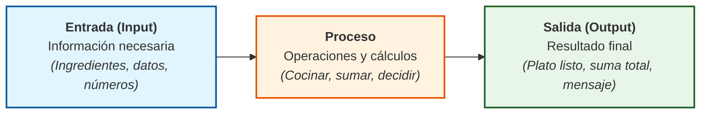
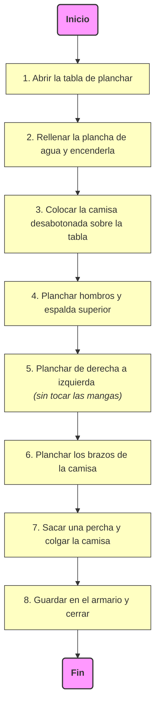
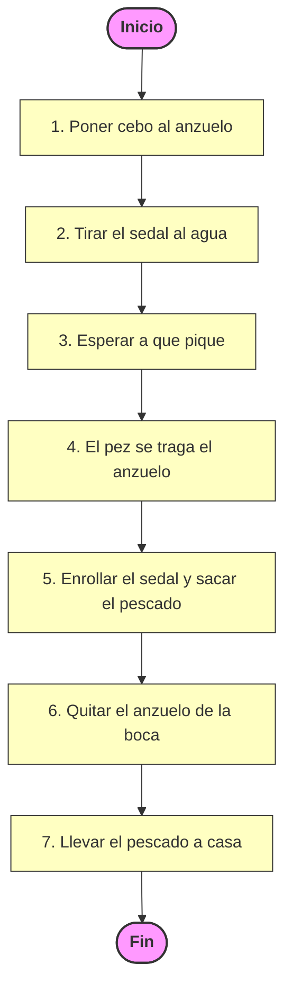
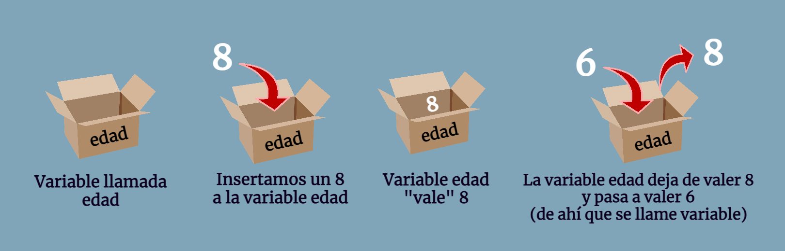
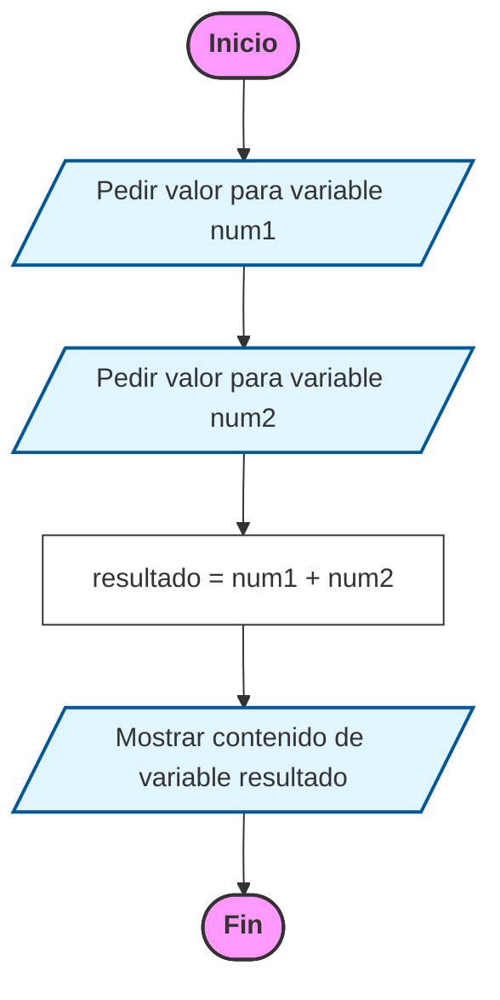

# 2. El Algoritmo: El motor del pensamiento lógico

Antes de tocar un teclado o abrir un programa, un programador debe resolver el problema en su mente. Esa solución es el **algoritmo**. Como vimos brevemente, un algoritmo no es exclusivo de la informática; es una herramienta que usamos a diario.

## 2.1. Definición y propiedades

!!!note "Definición de Algoritmo"
    Un **algoritmo** se define como un **conjunto de pasos** lógicos, sucesivos y bien definidos que permiten **resolver un problema o realizar una tarea**.

Para que un algoritmo sea considerado como tal en el ámbito técnico, debe cumplir con **tres reglas de oro**:

1.  **Precisión:** Cada paso debe estar perfectamente indicado. No puede haber ambigüedad (por ejemplo, en lugar de decir "echa un poco de sal", un algoritmo diría "añadir 5 gramos de sal").
2.  **Definición:** Si se sigue el algoritmo varias veces partiendo de los mismos datos, el resultado debe ser siempre el mismo.
3.  **Finitud:** Todo algoritmo debe tener un número determinado de pasos. Debe empezar y, obligatoriamente, terminar.

## 2.2. Anatomía de un algoritmo
Casi cualquier algoritmo se divide en tres partes fundamentales:

* **Entrada (Input):** La información que necesitamos para empezar (los ingredientes, los números a sumar, los datos del usuario).  
* **Proceso:** El conjunto de operaciones, cálculos y decisiones que transforman la entrada.  
* **Salida (Output):** El resultado final obtenido (el plato cocinado, el resultado de la suma, el mensaje en pantalla).  

## 2.3. Algoritmos cotidianos (Ejemplos detallados)
Analicemos algunos de los ejemplos que aparecen en la vida real para entender su estructura:

### A. Planchar una camisa (Proceso Secuencial)

Este es un algoritmo puramente lineal:

### B. El algoritmo de la pesca

## 2.4. De la realidad al ordenador: El concepto de `variable`
Cuando pasamos de "planchar una camisa" a "sumar números", necesitamos un concepto clave: la **Variable**. 

Imagina que una variable es una **caja con un nombre** escrita en el exterior. Dentro de esa caja podemos guardar un dato (un número, una palabra).

* Si quiero sumar dos números, necesito tres cajas: `num1`, `num2` y `resultado`.
* El algoritmo de una suma sería:

## 2.5. Errores comunes en el Diseño
* **Bucles infinitos:** Diseñar un algoritmo que nunca termina (ej: "Camina hacia adelante" sin decir cuándo parar).
* **Pasos omitidos:** Dar por hecho que la máquina sabe algo (ej: decirle al ordenador "Calcula el área" sin decirle antes cuánto miden los lados).
* **Ambigüedad:** Instrucciones que pueden interpretarse de varias formas (ej: "Añade un poco de agua" sin especificar cuánto es "un poco").