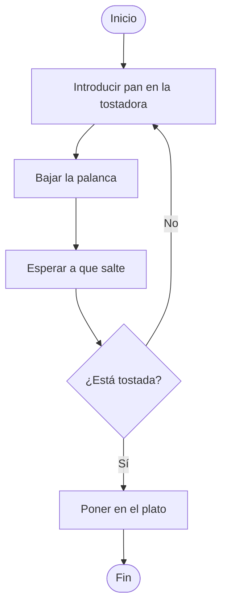
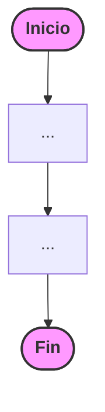
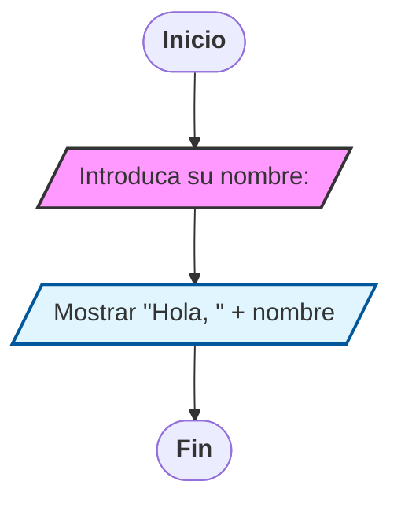
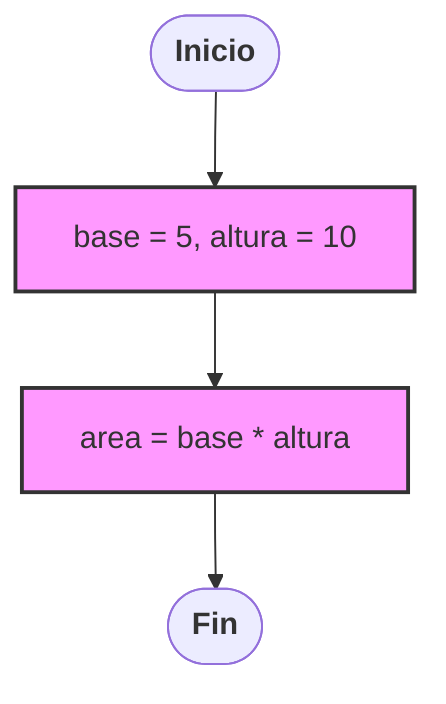
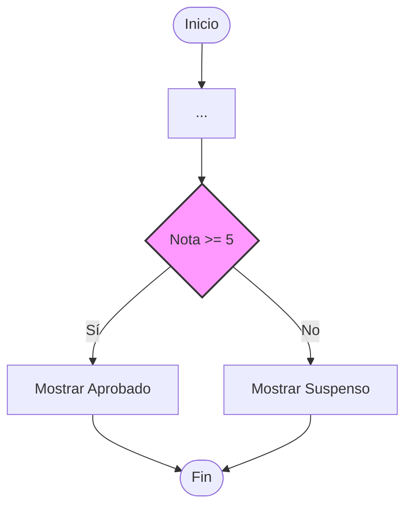
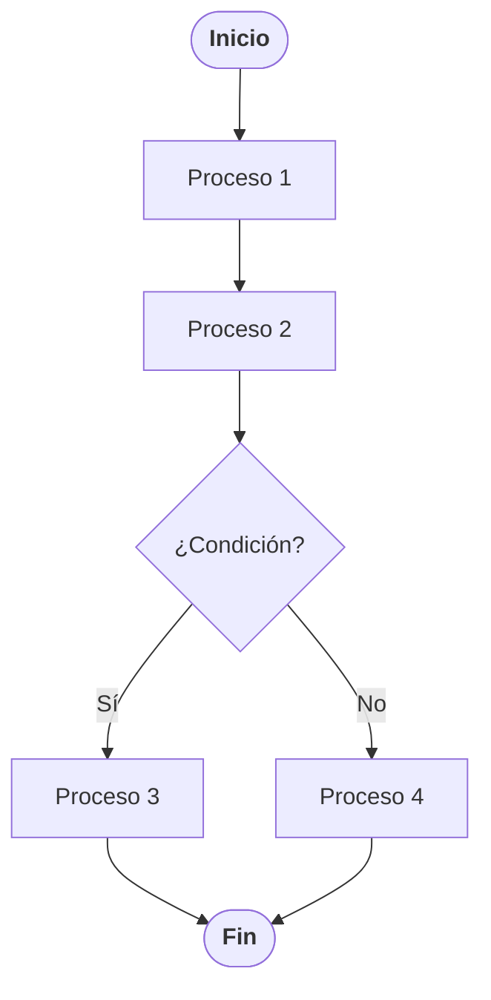

# 3. Diagramas de Flujo: La representación gráfica

Un **Diagrama de Flujo** (o *flowchart*) es una **herramienta visual que utiliza símbolos geométricos** para representar la secuencia de instrucciones de un algoritmo. Es el puente entre nuestra idea y el código definitivo.

## 3.1. ¿Por qué usarlos?
* **Claridad visual:** Permiten identificar errores en la lógica rápidamente.
* **Documentación:** Sirven para que otros programadores entiendan tu trabajo.
* **Universalidad:** Un diagrama de flujo bien hecho se puede programar en cualquier lenguaje (Python, C++, Scratch, etc.).

## 3.2. Simbología detallada y reglas de uso
Cada figura geométrica ten un significado específico que non se debe confundir. Segundo os estándares que manexamos na tecnoloxía:

### 1. Terminal (Óvalo)
* **Función:** Indica el **Inicio** y el **Fin** del programa.
* **Regla:** Todo diagrama debe tener exactamente uno de inicio y, al menos, uno de fin. Del bloque de Inicio solo puede salir una flecha.

### 2. Entrada / Salida (Paralelogramo)
* **Función:** Representa la interacción con el mundo exterior.
* **Entrada:** Lectura de datos (ej: "Introduce tu nombre", "Leer nota").
* **Salida:** Mostrar resultados en pantalla o impresora (ej: "Hola, Mundo", "El resultado es 10").

### 3. Proceso (Rectángulo)
* **Función:** Representa cualquier operación interna.
* **Ejemplos:** Cálculos matemáticos (`x = a + b`), asignación de valores (`puntos = 0`), o mover un objeto en la pantalla.

### 4. Decisión (Rombo)
* **Función:** Es el punto donde el programa toma un camino u otro tras evaluar una condición (que solo puede ser Verdadera o Falsa).
* **Regla:** Del rombo siempre deben salir **dos flechas** claramente etiquetadas como **SÍ** y **NO**.

### 5. Líneas de Flujo / Conectores (Flechas)
* **Función:** Indican el orden de ejecución.
* **Regla:** Siempre deben ser líneas rectas (horizontales o verticales) y deben conectar los bloques sin cruzarse. El flujo estándar es de **arriba hacia abajo** y de **izquierda a derecha**.

## 3.3. Estructuras de Control Avanzadas
Para que un diagrama de fluxo sexa realmente útil, debemos entender as dúas estruturas que rompen a liña recta:

### A. Estructuras Condicionales (Selección)
Se usan cuando el programa debe decidir. 
> **Ejemplo:** Un termostato.
> ¿La temperatura es menor de 18°C?
> * **SÍ:** Encender calefacción.
> * **NO:** Mantener apagada.

### B. Estructuras Iterativas (Bucles o Repeticiones)
Permiten que el flujo vuelva hacia atrás para repetir un proceso. Es fundamental para tareas repetitivas.
> **Ejemplo:** Un programa que pide una contraseña hasta que sea correcta.
> 1. Pedir contraseña.
> 2. ¿Es correcta?
>     * **NO:** Volver al paso 1 (Bucle).
>     * **SÍ:** Entrar al sistema.

---

## 3.4. Ejemplos Prácticos de Programación
Vexamos como pasar os algoritmos dos teus arquivos a diagramas reais:

**Ejemplo 1: Cálculo del área de un rectángulo**

1. **Inicio**
2. **Entrada:** Leer Base **B** y Altura **H**.
3. **Proceso:** Calcular **Area = B * H**.
4. **Salida:** Mostrar el valor de **Area**.
5. **Fin**

**Ejemplo 2: ¿Aprobado o Suspenso?**

1. **Inicio**
2. **Entrada:** Leer **Nota**.
3. **Decisión:** ¿**Nota >= 5**?
    * **SÍ:** Mostrar "**Aprobado**".
    * **NO:** Mostrar "**Suspenso**".
4. **Fin**

---

## 3.5. Normas de Oro para dibujar Diagramas
* No usar flechas que terminen en el aire; todas deben llegar a un bloque o a otra línea.
* El texto dentro de los símbolos debe ser breve y claro.
* Evitar que las líneas se crucen entre sí (usar conectores si el diagrama es muy grande).  
* Siempre seguir el flujo de arriba hacia abajo y de izquierda a derecha para facilitar la lectura.